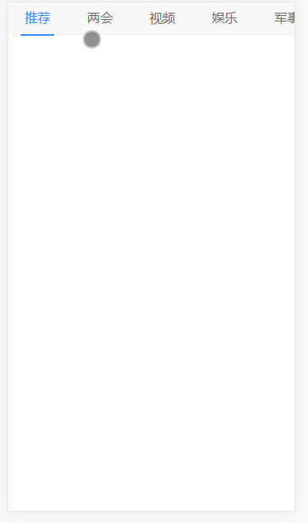

A channel nav bar in Baidu H5 style

推荐 | 两会 | 视频 | 娱乐 | 军事 | 汽车 | ...

When you click the channel button on the right side,\
the nav bar will move to left and the channel button clicked will stay at the screen center. 

Demo

